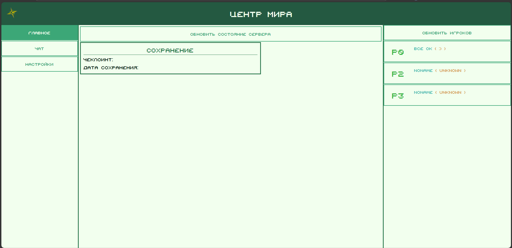
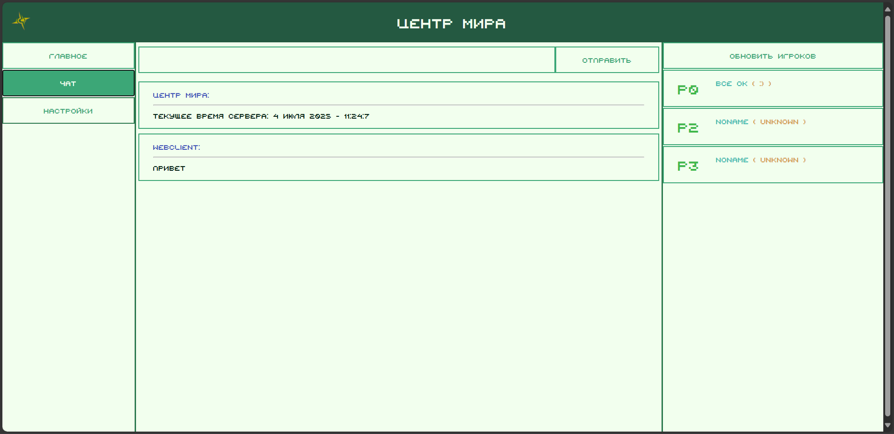
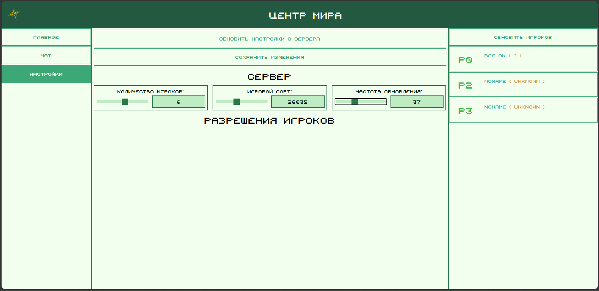

## Центр мира

Панель управления для сервера игры `Heroes of Envell`. 
Центр мира появляется при включение сервера игры по адресу: [localhost:8080](http://localhost:8080).

*Центр мира состоит из 3 вкладок и 3 панелей.*

#### Панели:

1. **Панель управления вкладками**
   - Левая панель.
   - Здесь размещены кнопки для перемещения между вкладками
2. **Главная панель**
   - Центральная панель.
   - Здесь размещена текущая вкладка.
3. **Панель, отображающая игроков**
   - Правая панель.
   - Здесь размещены карточки игроков. 
   - Если нажать на карточку игрока, можно увидеть более подробную информацию о игроке.
   - Содержимое обновляется и по нажатию на кнопку `Обновить игроков`.

#### Вкладки:

- **Главная вкладка**
  - Здесь расположены основные данные текущей сессии. Они обновляются по нажатию на кнопку `Обновить состояние сервера`.

  - 
- **Вкладка чата**
  - Состоит из поле ввода, кнопки `Отправить` и сообщений. Позволяет отправлять сообщения в чат (*можно вводить команды*). Сообщения обновляются каждую секунду.
 
  - 
- **Вкладка настроек**
  - Содержит настройки, полученные с сервера. Настройки обновить можно через кнопку `Обновить настройки с сервера`. Сохраняет настройки через нажатие кнопки `Сохранить изменения`.

  - 

### Горячие клавиши:

- `Alt+1 - Alt+3` - переключает на другую вкладку
- `Alt+PageDown` - переключает на следующую вкладку
- `Alt+PageUp` - переключает на прошлую вкладку

### Ссылки:

- *Репозиторий движка игры*: [*Клик*](https://github.com/traeterno/Ae2D) 
- *Репозиторий сервера игры*: [*Клик*](https://github.com/traeterno/EnvellServer)